# New England
## A truly comfortable light theme for Visual Studio Code

Designed from the ground up as a light theme, New England has a comfortable and legible contrast that will handle long hours at the screen, variable display brightness, and late-night redshifting by f.lux or Night Shift. Thanks for coming to visit. We hope you like it here, and we hope you stay.

## Screenshots:

## Typescript
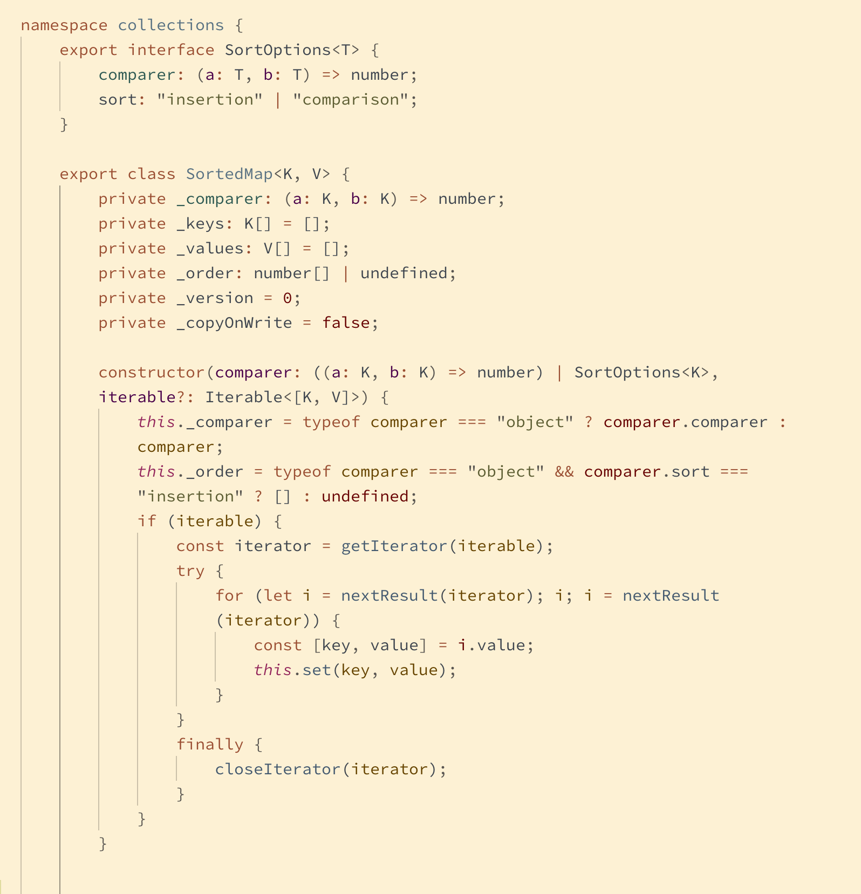

## React
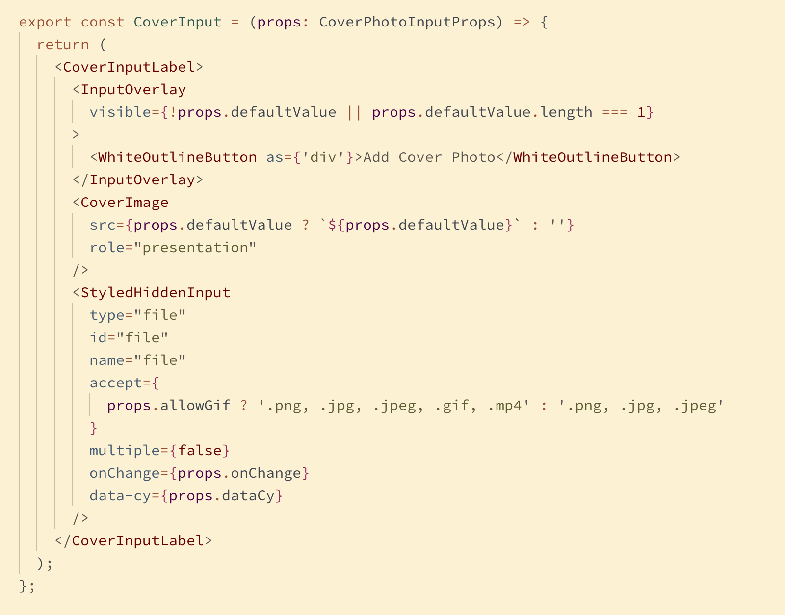

## Elixir
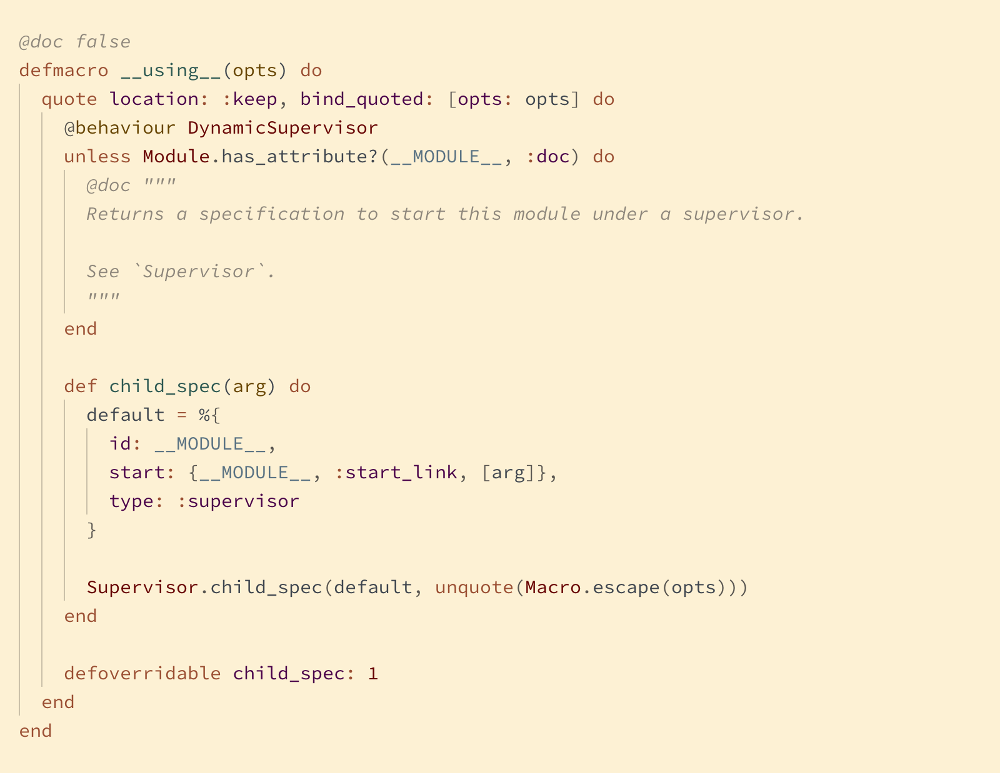

## Ruby
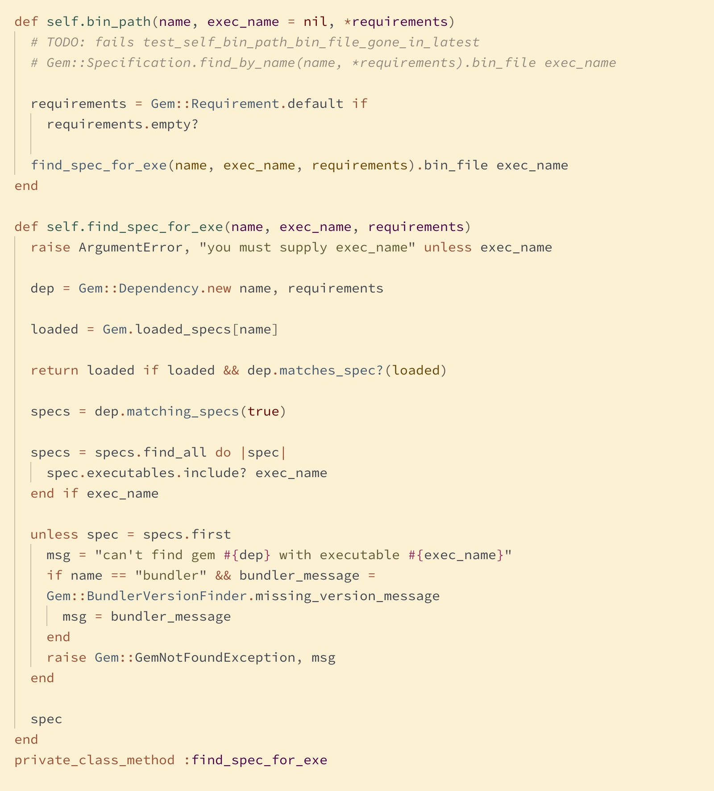

## Rust
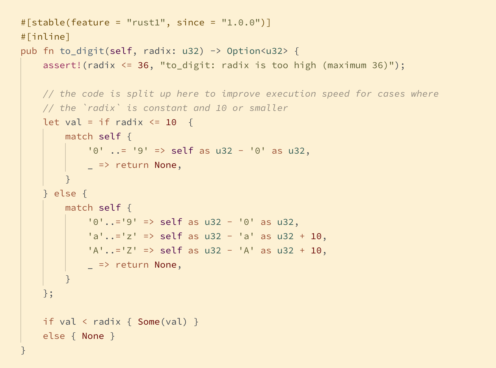

## Go
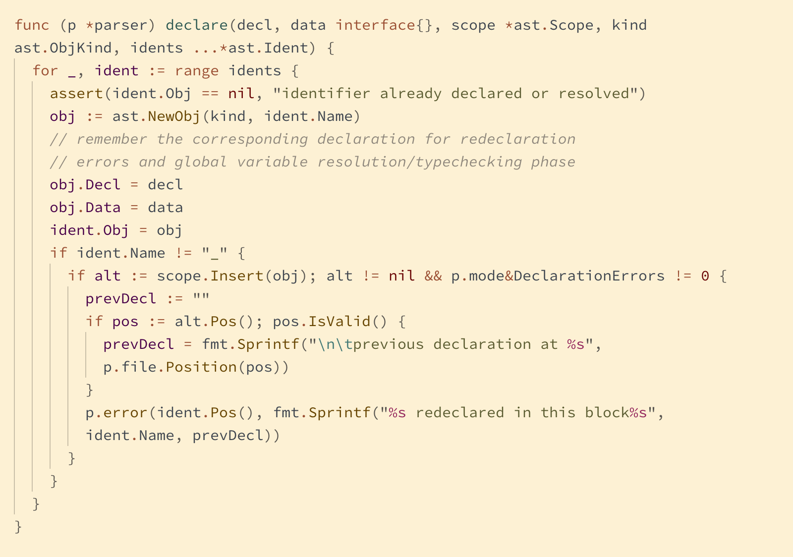

## Elm
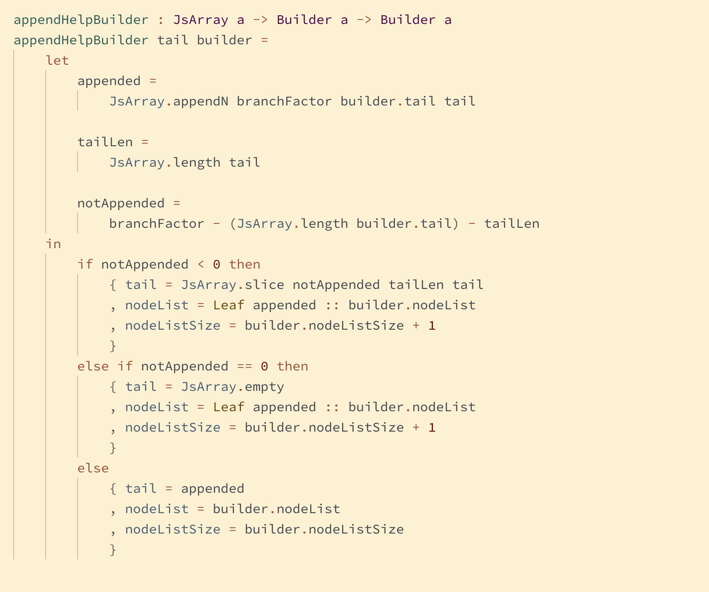

## HTML
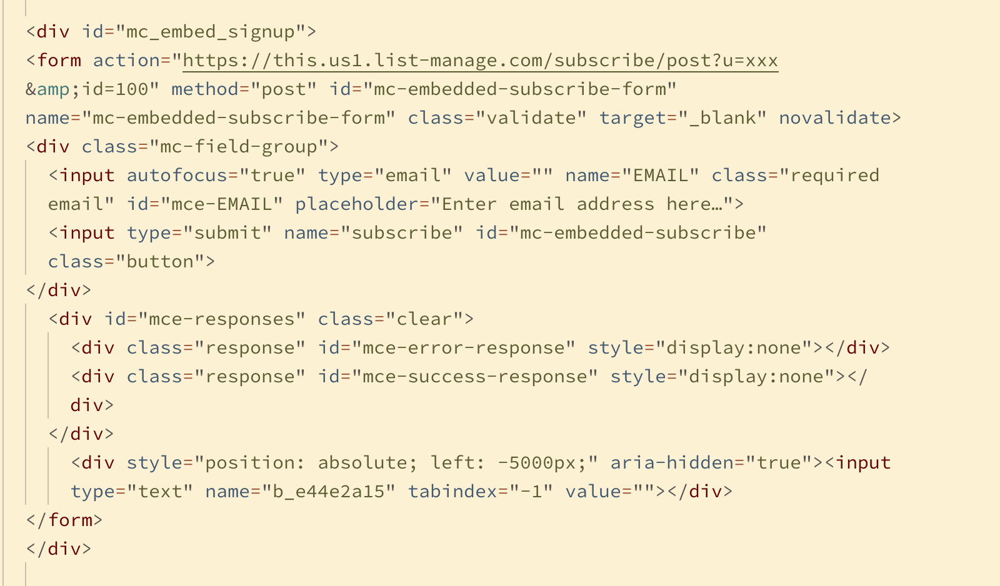

## CSS
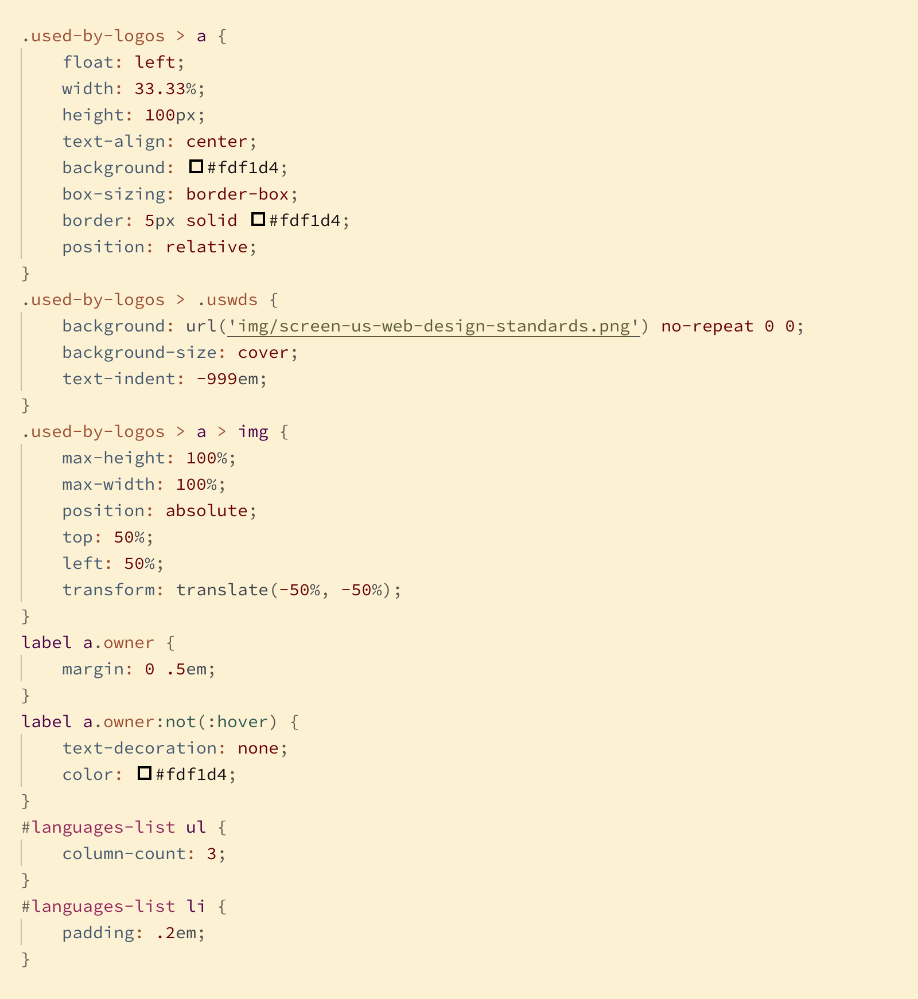

## Python
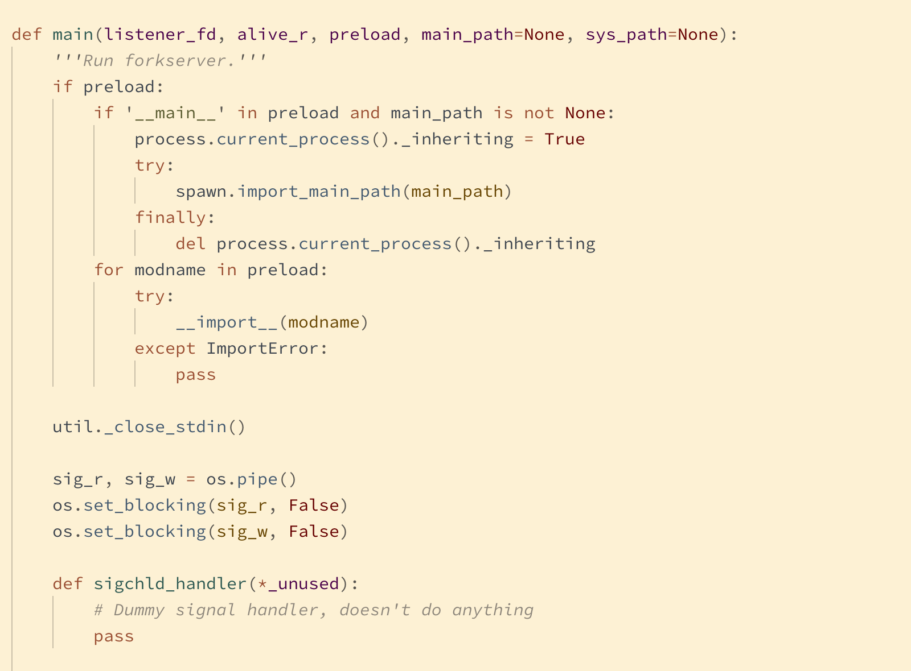

## Markdown
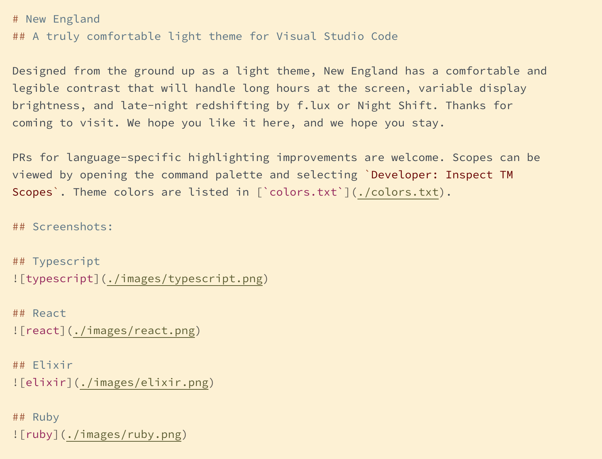

## Supported languages and extensions:

- AsciiDoc ([AsciiDoc](https://marketplace.visualstudio.com/items?itemName=joaompinto.asciidoctor-vscode))
- C ([C/C++](https://marketplace.visualstudio.com/items?itemName=ms-vscode.cpptools))
- C# ([C#](https://marketplace.visualstudio.com/items?itemName=ms-dotnettools.csharp))
- C++ ([C/C++](https://marketplace.visualstudio.com/items?itemName=ms-vscode.cpptools))
- Clojure
- Crystal ([Crystal Language](https://marketplace.visualstudio.com/items?itemName=faustinoaq.crystal-lang))
- CSS
- Dart ([Dart Code](https://marketplace.visualstudio.com/items?itemName=Dart-Code.dart-code))
- Elixir ([vscode-elixir](https://marketplace.visualstudio.com/items?itemName=mjmcloug.vscode-elixir) or [ElixirLS](https://marketplace.visualstudio.com/items?itemName=JakeBecker.elixir-ls))
- Elm ([Elm](https://marketplace.visualstudio.com/items?itemName=Elmtooling.elm-ls-vscode))
- Erlang ([erlang](https://marketplace.visualstudio.com/items?itemName=pgourlain.erlang))
- Go ([Go](https://marketplace.visualstudio.com/items?itemName=ms-vscode.Go))
- Haskell ([Haskell Syntax Highlighting](https://marketplace.visualstudio.com/items?itemName=justusadam.language-haskell))
- HTML
- Java ([Java Extension Pack](https://marketplace.visualstudio.com/items?itemName=vscjava.vscode-java-pack))
- JavaScript ([Babel JavaScript](https://marketplace.visualstudio.com/items?itemName=mgmcdermott.vscode-language-babel))
- LaTeX ([LaTeX Workshop](https://marketplace.visualstudio.com/items?itemName=James-Yu.latex-workshop))
- Lua ([Lua](https://marketplace.visualstudio.com/items?itemName=sumneko.lua))
- Markdown
- PHP
- Python ([Python](https://marketplace.visualstudio.com/items?itemName=ms-python.python))
- Ruby ([Ruby](https://marketplace.visualstudio.com/items?itemName=rebornix.Ruby) + [VSCode Ruby](https://marketplace.visualstudio.com/items?itemName=wingrunr21.vscode-ruby))
- Rust ([Rust (rls)](https://marketplace.visualstudio.com/items?itemName=rust-lang.rust))
- TypeScript

<!--
## Planned languages:

- F#
- Gleam
- GraphQL
- Idris
- Julia
- Kotlin
- Objective-C
- OCaml
- Perl
- Pony
- R
- Reason ML
- reStructuredText
- Scala
- Shell Script
- SQL
- Swift
- TLA+
-->

PRs for language-specific highlighting improvements are welcome. Scopes can be viewed by opening the command palette and selecting `Developer: Inspect Editor Tokens and Scopes`. Theme colors are listed in [`colors.txt`](./colors.txt).
