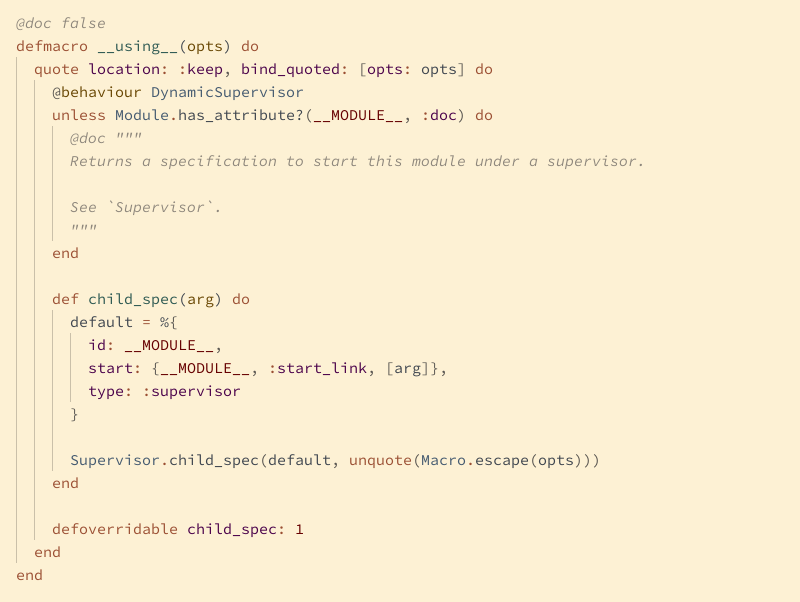

# New England
## A truly comfortable light theme for Visual Studio Code

Designed from the ground up as a light theme, New England has a comfortable and legible contrast that will handle long hours at the screen, variable display brightness, and late-night redshifting by f.lux or Night Shift. Thanks for coming to visit. We hope you like it here, and we hope you stay.

## Screenshots:

## Typescript

     
## React

## Elixir

## Ruby

## Rust

## Go

## Elm

## HTML

## CSS

## Python

## Markdown

## Supported languages (more to be added soon!):

- C
- C#
- C++
- Clojure
- CSS
- Elixir
- Elm
- Erlang
- Go
- Haskell
- HTML
- Java
- JavaScript
- LaTeX
- Lua
- Markdown
- PHP
- Python
- Ruby
- Rust
- TypeScript

<!--
## Planned languages:

- Crystal
- Dart
- F#
- Gleam
- GraphQL
- Julia
- Kotlin
- Objective-C
- OCaml
- Perl
- Pony
- R
- Reason ML
- Scala
- Shell Script
- SQL
- Swift
- TLA+
-->

PRs for language-specific highlighting improvements are welcome. Scopes can be viewed by opening the command palette and selecting `Developer: Inspect TM Scopes`. Theme colors are listed in [`colors.txt`](./colors.txt).
