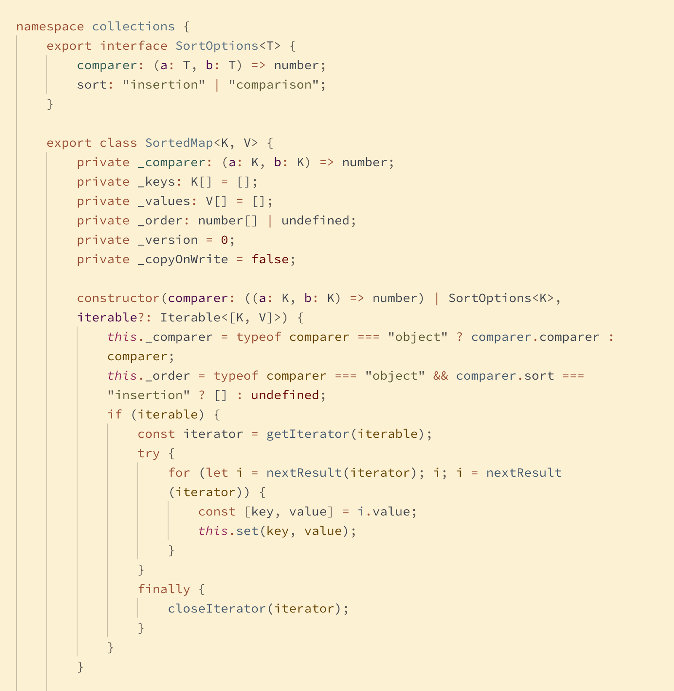
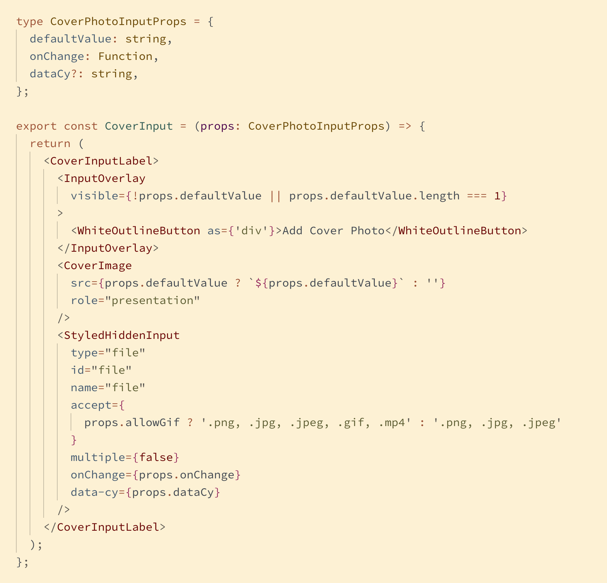
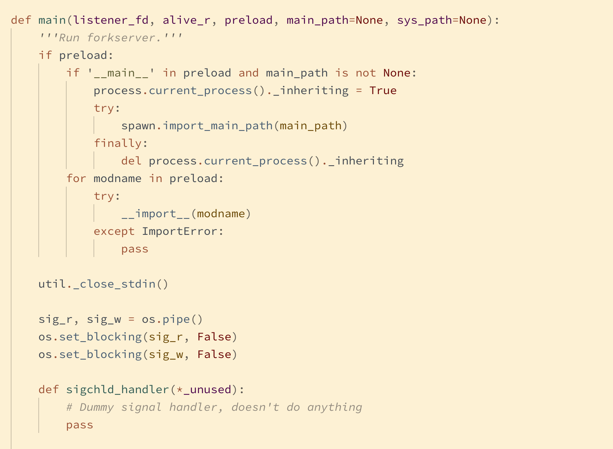

# New England
## A truly comfortable light theme for Visual Studio Code

Designed from the ground up as a light theme, New England has a comfortable and legible contrast that will handle long hours at the screen, variable display brightness, and late-night redshifting by f.lux or Night Shift. Thanks for coming to visit. We hope you like it here, and we hope you stay.

PRs for language-specific highlighting improvements are welcome. Scopes can be viewed by opening the command palette and selecting `Developer: Inspect TM Scopes`. Theme colors are listed in [`colors.txt`](./colors.txt).

## Screenshots:

### Typescript

### React

### HTML

### CSS

### Elixir

### Python

